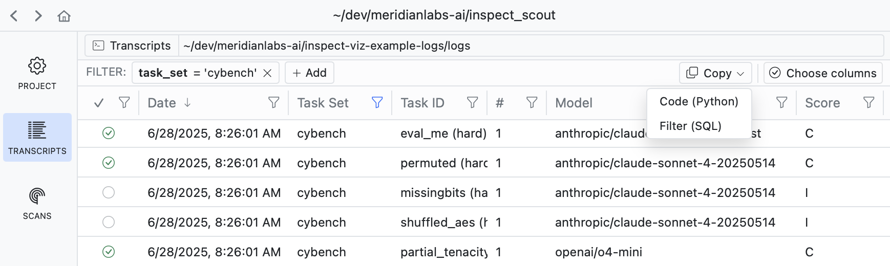

You can use Scout View to view and filter transcripts:

{.border}

If you filter down into a set of transcripts that you want to analyze, use the **Copy** button to copy the code required to apply the filter:

{.border}

