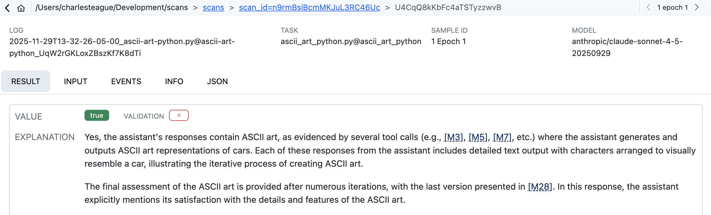

A `ValidationSet` contains a list of `ValidationCase`, which are in turn composed of ids and targets. The most common validation set is a pair of transcript id and `value` that the scanner should have returned.

| Transcript ID          | Expected Value |
|------------------------|----------------|
| Fg3KBpgFr6RSsEWmHBUqeo | true           |
| VFkCH7gXWpJYUYonvfHxrG | false          |

Note that values can be of any type returned by a scanner, and it is also possible to do greater than / less than checks or write custom predicates.


#### Development

How would you develop a validation set like this? Typically, you will review some of your existing transcripts using **Scout View**, decide which ones are good validation examples, copy their transcript id (which is the same as the sample UUID), then record the appropriate entry in a text file or spreadsheet.

Use the **Copy** button to copy the UUID for the transcript you are reviewing:

{.border}

As you review transcript and find good examples, build up a list of transcript IDs and expected values. For example, here is a CSV file of that form:

``` {.default filename="ctf-validation.csv"}
id,target
Fg3KBpgFr6RSsEWmHBUqeo,true
VFkCH7gXWpJYUYonvfHxrG,false
SiEXpECj7U9nNAvM3H7JqB,true
```

#### Scanning

You'll typically create a distinct validation set for each scanner, and then pass the validation sets to `scan()` as a dict mapping scanner to set:

``` {.python filename="scanning.py"}
from inspect_scout import scan, transcripts_from, validation_set

scan(
    scanners=[ctf_environment(), java_tool_usages()],
    transcripts=transcripts_from("./logs"),
    validation={
        "ctf_environment": validation_set("ctf-validation.csv")
    }
)
```

You can also specify validation sets on the command line. If the above scan was defined in a `@scanjob` you could add a validation set from the CLI using the `-V` option as follows:

``` bash
scout scan scanning.py -V ctf_environment:ctf_environment.csv
```

This example uses the simplest possible id and target pair (transcript \_id =\> boolean). Other variations are possible, see the [IDs and Targets](#ids-and-targets) section below for details. You can also use other file formats for validation sets (e.g. YAML), see [Validation Files](#validation-files) for details.

#### Results

Validation results are reported in three ways:

-   The scan status/summary UI provides a running tabulation of the percentage of matching validations.

-   The data frame produced for each scanner includes columns for the validation:

    -   `validation_target`: Ideal scanner result

    -   `validation_result`: Result of comparing scanner `value` against `validation_target`

-   Scout View includes a visual indication of the validation status for each transcript:

    {.border}

