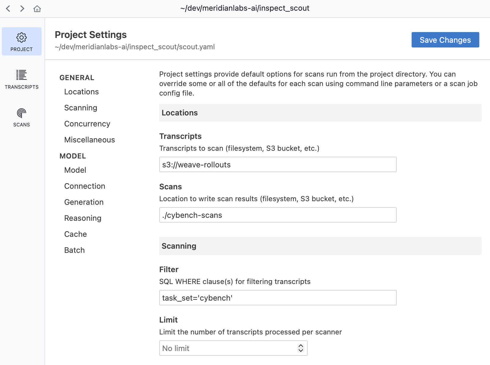

# Inspect Scout


## Welcome

Welcome to Inspect Scout, a tool for in-depth analysis of AI agent
transcripts. With Scout, you can easily:

1.  Detect issues like misconfigured environments, refusals, and
    evaluation awareness using LLM-based or pattern-based scanners.
2.  Analyze transcripts from Inspect, Arize Phoenix, LangSmith, Logfire,
    Claude Code, or custom sources via the capture and import APIs.
3.  Develop scanners interactively, exploring transcripts and scan
    results visually in Scout View.
4.  Validate scanner accuracy against human-labeled examples.
5.  Handle complex scanning requirements like multi-agent transcripts,
    compaction, and context-window chunking.
6.  Scale to thousands of transcripts with parallel processing,
    batching, and fault tolerance.

### Installation

Install the `inspect_scout` package from PyPI with:

``` bash
pip install inspect-scout
```

You should also be sure to install the [Inspect AI VS Code
Extension](https://inspect.aisi.org.uk/vscode.html) which includes
features for viewing and debugging Scout scans.

## Scout Basics

Below we’ll provide some simple examples of creating and using Scout
scanners. Some core components we’ll make use of here include:

- **Transcript** — LLM conversation to analyze (e.g. an agent rollout or
  a sample from an Inspect eval).

- **Scanner** — Function that takes an input from a `Transcript` and
  returns a `Result` (conceptually very similar to an Inspect `Scorer`).

- **Results** — Data frame(s) that includes the results of scanners
  applied to transcripts.

### LLM Scanner

For many applications you can use the high-level `llm_scanner()`, which
uses a model for transcript analysis and can be customized with many
options. For example:

**scanner.py**

``` python
from inspect_scout import Scanner, Transcript, llm_scanner, scanner

@scanner(messages="all")
def ctf_environment() -> Scanner[Transcript]:
    return llm_scanner(
        question="In the transcript above do you detect "
        "instances of environment misconfiguration "
        "preventing the agent from completing it's task?",
        answer="boolean"
    )
```

The `llm_scanner()` supports a wide variety of model answer types
including boolean, number, string, classification (single or multi), and
structured JSON output. For additional details, see the [LLM
Scanner](llm_scanner.qmd) article.

### Grep Scanner

Using an LLM to search transcripts is often required for more nuanced
judgements, but if you are just looking for text patterns, you can also
use the `grep_scanner()`. For example, here we search assistant messages
for references to phrases that might indicate secrets:

``` python
from inspect_scout import Transcript, grep_scanner, scanner

@scanner(messages=["assistant"])
def secrets() -> Scanner[Transcript]:
    return grep_scanner(["password", "secret", "token"])
```

For additional details on using this scanner, see the [Grep
Scanner](grep_scanner.qmd) article.

### Custom Scanners

If the higher level LLM and Grep scanners don’t meet your requirements,
you can write a custom scanners with whatever behavior you need. For
example, the following illustrates the implementation of a basic LLM
scanner (click on the numbers at right for further explanation):

**scanner.py**

``` python
from inspect_scout import (
    Result, Scanner, Transcript, scanner, message_numbering
)

from inspect_ai.model import get_model
import re

@scanner(messages="all")
def ctf_environment() -> Scanner[Transcript]:
    
    async def scan(transcript: Transcript) -> Result:

        # setup message numbering
        messages_as_str, extract_refs = message_numbering()

        # call model
        output = await get_model().generate(
            "Here is a transcript of an LLM agent " +
            "solving a cybersecurity challenge:\n\n" +
            "===================================" +
            await messages_as_str(transcript.messages) +
            "===================================\n\n" +
            "In the transcript above do you detect any " +
            "instances of environment misconfiguration " +
            "preventing the agent from completing its " +
            "task? If no, simply respond with 'No'. " +
            "If yes, respond with 'Yes' followed by an " +
            "explanation."
        )

        # extract the first word
        match = re.match(r"^\w+", output.completion.strip())

        # return result
        if match:
            answer = match.group(0)
            explanation = output.completion
            return Result(
                value=answer.lower() == "yes",
                answer=answer,
                explanation=explanation,
                references=extract_refs(explanation)
            )
        else:
            return Result(value=False, explanation=output.completion)

    return scan
```

Line 8  
Scanners are decorated with `@scanner` so they can specify the exact
subset of content they need to read. In this case only messages (and not
events) will be read from the log, decreasing load time.

Line 17  
Scanners frequently use models to perform scanning. Calling
`get_model()` utilizes the default model for the scan job (which can be
specified in the top level call to scan).

Lines 20-22  
Convert the message history into a string for presentation to the model.
The `messages_as_str()` function takes a `Transcript | list[Messages]`
and will by default remove system messages from the message list. See
`MessagesPreprocessor` for other available options.

Lines 38-43  
As with scorers, results also include additional context (here the
extracted answer, full model completion, and message references).

For more details on creating custom scanners, including scanning
individual messages or events, handling compaction and context overflow,
and computing metrics, see the article on [Custom
Scanners](custom_scanner.qmd).

### Running a Scan

Use the `scout scan` command to run one or more scanners on a set of
transcripts. The `Scanner` will be called once for each `Transcript`.
For example:

``` bash
scout scan scanner.py -T ./logs --model openai/gpt-5
```

The `-T` argument indicates which transcripts to scan (in this case a
local Inspect log directory). You can also scan from a [transcripts
database](transcripts.qmd#transcripts-database) that is either local or
on S3. For example, here we scan some W&B Weave transcripts stored on
S3:

``` bash
scout scan scanner.py -T s3://cybench-rollouts --model openai/gpt-5
```

Note that when we using a model that requires an API key you’ll need to
provide it in the enviroment (e.g. `OPENAI_API_KEY`). As with Inspect
AI, you can use a [.env
file](https://inspect.aisi.org.uk/options.html#env-files) for providing
API keys.

### Scout View

Scout includes a viewer application for looking at scan results in
depth. Run the viewer with:

``` bash
scout view
```


By default this will view the scan results in the `./scans` directory of
the current working directory. Specify an alternate results location
with:

``` bash
scout view --scans s3://my-scan-results
```

You can also list recent scans with the `scout scan list` command:

``` bash
scout scan list
```

Scans will be listed from most to least recent. If you are running
within VS Code you can click the scans in the list to view them in a VS
Code editor. The VS Code Scout activity bar also includes a scans pane
that lists recent scans.

### Projects

In some cases you’ll prefer to define your transcript source, scanning
model, and other configuration once for a project rather than each time
you run `scout scan`. You can do this with a `scout.yaml` project file.
For example, if we have this project file in our working directory:

**scout.yaml**

``` yaml
transcripts: s3://weave-rollouts/cybench
model: openai/gpt-5
```

Then we can run our scan with simply:

``` bash
scout scan scanner.py 
```

Use Scout View to explore and manage project settings:



See the [Projects](projects.qmd) article for more details on managing
configuration with projects.

## Scan Jobs

You may want to import scanners from other modules and compose them into
a `ScanJob`. To do this, add a `@scanjob` decorated function to your
source file (it will be used in preference to `@scanner` decorated
functions).

A `ScanJob` can also include `transcripts` or any other option that you
can pass to `scout scan` (e.g. `model`). For example:

**scanning.py**

``` python
from inspect_scout import ScanJob, scanjob

@scanjob
def job() -> ScanJob:
    return ScanJob(
        scanners=[ctf_environment(), java_tool_usages()],
        transcripts="./logs",
        model="openai/gpt-5"
    )
```

You can then use the same command to run the job (`scout scan` will
prefer a `@scanjob` defined in a file to individual scanners):

``` bash
scout scan scanning.py
```

You can also specify a scan job using YAML or JSON. For example, the
following is equivalent to the example above:

**scan.yaml**

``` yaml
scanners:
  - name: deception
    file: scanner.py
  - name: java_tool_usages
    file: scanner.py

transcripts: logs
filter: task_set='cybench'

model: openai/gpt-5
```

Which can be executed with:

``` bash
scout scan scan.yaml
```

Note that if you had a scout.yaml [project file](#projects) defining the
`transcripts`, `filter`, and `model` for your project, you could exclude
them from your scan job as they will be automatically merged from the
project.

## Scan Results

By default, the results of scans are written into the `./scans`
directory. You can override this using the `--scans` option—both local
file paths and remote filesystems (e.g. `s3://`) are supported.

Each scan is stored in its own directory and has both metadata about the
scan (configuration, errors, summary of results) as well as parquet
files that contain the results. You can read the results as a dict of
Pandas data frames using the `scan_results_df()` function:

``` python
# results as pandas data frames
results = scan_results_df("scans/scan_id=iGEYSF6N7J3AoxzQmGgrZs")
deception_df = results.scanners["deception"]
tool_errors_df = results.scanners["tool_errors"]
```

See the [Results](results.qmd) article for more details on the columns
available in the data frames returned by `scan_results_df()`.

## Validation

When developing scanners, it’s often desirable to create a feedback loop
based on human labeling of transcripts that indicate expected scanner
results. You can do this by creating a validation set and applying it
during your scan:


The *validation set* is the set of labeled transcripts that are compared
against scan results. Validation sets are typically associated with the
domain of a particular scanner type (e.g. “evaluation awareness”,
“refusal”, etc.) so you will likely develop many of them for use with
different scanners.

You can create and edit validation sets directly within the transcript
or scan results view:


Apply a validation set by passing it to `scan()`. For example:

``` python
from inspect_scout import scan, transcripts_from

from my_scanners import eval_awareness

scan(
    scanners=[eval_awareness()],
    transcripts=transcripts_from("./logs"),
    validation="eval-awareness.csv"
)
```

To learn more about building and using validation sets see the article
on [Validation](validation.qmd).

## Handling Errors

If a scan job is interrupted either due to cancellation (Ctrl+C) or a
runtime error, you can resume the scan from where it left off using the
`scan resume` command. For example:

``` bash
scout scan resume "scans/scan_id=iGEYSF6N7J3AoxzQmGgrZs"
```

By default, if errors occur during an individual scan, they are caught
and reported. You can then either retry the failed scans with
`scan resume` or complete the scan (ignoring errors) with
`scan complete`:


If you prefer to fail immediately when an error occurs rather than
capturing errors in results, use the `--fail-on-error` flag:

``` bash
scout scan scanner.py -T ./logs --fail-on-error
```

With this flag, any exception will cause the entire scan to terminate
immediately. This can be valuable when developing a scanner.

## Transcripts

In the example(s) above we scanned all available transcripts. Often
though you’ll want to scan only a subset of transcripts. For example,
here we filter down to only Cybench logs:

``` python
from inspect_scout (
    import scan, transcripts_from, columns as c
)

from .scanners import deception, tool_errors

transcripts = transcripts_from("s3://weave-rollouts")
transcripts = transcripts.where(c.task_set == "cybench")

status = scan(
    scanners = [ctf_environment(), tool_errors()],
    transcripts = transcripts
)
```

The `columns` object (aliased to `c`) provides a convenient way to
specify `where()` clauses for filtering transcripts.

Note that doing this query required us to switch to the Python `scan()`
API. We can still use the CLI if we wrap our transcript query in a
`ScanJob`:

**cybench_scan.py**

``` python
from inspect_scout (
    import ScanJob, scanjob, transcripts_from, columns as c
)

from .scanners import deception, tool_errors

@scanjob
def cybench_job(logs: str = "./logs") -> ScanJob:

    transcripts = transcripts_from(logs)
    transcripts = transcripts.where(c.task_set == "cybench")

    return ScanJob(
        scanners = [deception(), java_tool_usages()],
        transcripts = transcripts
    )
```

Then from the CLI:

``` bash
scout scan cybench.py -S logs=./logs --model openai/gpt-5
```

The `-S` argument enables you to pass arguments to the `@scanjob`
function (in this case determining what directory to read logs from).

See the article on [Transcripts](transcripts.qmd) to learn more about
the various ways to create, read, and filter transcripts.

## Parallelism

The Scout scanning pipeline is optimized for parallel reading and
scanning as well as minimal memory consumption. There are a few options
you can use to tune parallelism:

| Option | Description |
|----|----|
| `--max-transcripts` | The maximum number of transcripts to scan in parallel (defaults to 25). You can set this higher if your model API endpoint can handle larger numbers of concurrent requests. |
| `--max-connections` | The maximum number of concurrent requests to the model provider (defaults to `--max-transcripts`). |
| `--max-processes` | The maximum number of processes to use for parsing and scanning (defaults to 4). |

## Learning More

Above we provided a high-level tour of Scout features. See the following
articles to learn more about using Scout:

- [Scanners](scanners.qmd): Basics of using scanners including the
  high-level [LLM Scanner](llm_scanner.qmd) and [Grep
  Scanner](grep_scanner.qmd).

- [Examples](examples.qmd): Example implementations of various types of
  scanners.

- [Projects](projects.qmd): Managing scanning configuration using
  project files.

- [Transcripts](transcripts.qmd): Reading and filtering transcripts for
  scanning.

- [Workflow](workflow.qmd): Workflow for the stages of a transcript
  analysis project.

There is also more in depth documentation available on
[Results](results.qmd), [Validation](validation.qmd) and [Transcript
Databases](db_overview.qmd).
