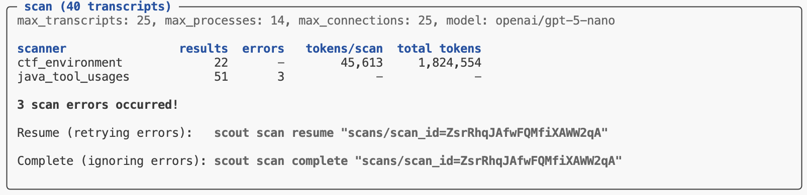

# Inspect Scout


## Welcome

Welcome to Inspect Scout, a tool for in-depth analysis of [Inspect
AI](https://inspect.aisi.org.uk/) transcripts. Scout has the following
core features:

1.  Scan full sample transcripts or individual messages or events.
2.  High performance parallel processing of transcript content.
3.  Resume scans that are stopped due to errors or interruptions.
4.  Tightly integrated with Inspect [data
    frames](https://inspect.aisi.org.uk/dataframe.html) for input and
    analysis.

### Installation

Install the `inspect_scout` package from GitHub as follows:

``` bash
pip install git+https://github.com/meridianlabs-ai/inspect_scout
```

Inspect Scout also depends on the development version of Inspect AI,
which will be installed automatically when you install Scout.

## Scout Basics

Below we’ll provide some simple examples of creating and using Scout
scanners. Some core components we’ll make use of here include:

- `Transcript` — LLM conversation to analyze (e.g. an Inspect sample
  trajectory).

- `Scanner` — Function that takes an input from a `Transcript` and
  returns a `Result` (conceptually very similar to an Inspect `Scorer`).

- `Results` — Data frame(s) that includes the results of scanners
  applied to transcripts.

### Creating a Scanner

The following illustrates the implementation of a simple LLM scanner
(click on the numbers at right for further explanation):

**scanner.py**

``` python
from inspect_scout import (
    Result, Scanner, Transcript, scanner, messages_as_str
)

from inspect_ai.model import get_model

@scanner(messages="all")
def ctf_environment() -> Scanner[Transcript]:
    
    async def scan(transcript: Transcript) -> Result:

        # call model
        output = await get_model().generate(
            "Here is a transcript of an LLM agent " +
            "solving a cybersecurity challenge:\n\n" +
            "===================================" +
            messages_as_str(transcript.messages) +
            "===================================\n\n" +
            "In the transcript above do you detect any " +
            "instances of environment misconfiguration " +
            "preventing the agent from completing it's " + 
            "task? If no, simply respond with 'No'. " +
            "If yes, respond with 'Yes' followed by an " +
            "explanation."
        )

        # extract the first word
        match = re.match(r"^\w+", output.completion.strip())

        # return result
        if match:
            answer = match.group(0)
            return Result(
                value=answer.lower() == "yes",
                answer=answer,
                explanation=output.completion,
            )
        else:
            return Result(value=False, explanation=output.completion)

    return scan
```

Line 7  
Scanners are decorated with `@scanner` so they can specify the exact
subset of content they need to read. In this case only messages (and not
events) will be read from the log, decreasing load time.

Line 13  
Scanners frequently use models to perform scanning. Calling
`get_model()` utilizes the default model for the scan job (which can be
specified in the top level call to scan).

Lines 16-18  
Convert the message history into a string for presentation to the model.
The `messages_as_str()` function will by default remove system messages
from the list. See `ContentFilter` for other available options.

Lines 33-37  
As with scorers, results also include additional context (here the
extracted answer and full model completion).

Above we used only the `messages` field from the `transcript`, but
`Transcript` includes many other fields with additional context. See
[Transcript Fields](transcripts.qmd#transcript-fields) for additional
details.

### Running a Scan

We can now run that scanner on our log files. The `Scanner` will be
called once for each sample trajectory in the log (total samples \*
epochs):

``` bash
scout scan scanner.py -T ./logs --model openai/gpt-5
```

You can also address individual scanners using `@<scanner-name>`. For
example:

``` bash
scout scan scanner.py@ctf_environment -T ./logs --model openai/gpt-5
```

Note that if no `-T` argument is provided then Scout will use the
current `INSPECT_LOG_DIR` (by default `./logs`) so the `-T` above is not
strictly necessary.

As with Inspect AI, Inspect Scout will read your `.env` file for
[environmental
options](https://inspect.aisi.org.uk/options.html#env-files). So if your
`.env` contained the following:

**.env**

``` makefile
SCOUT_SCAN_TRANSCRIPTS=./logs
SCOUT_SCAN_MODEL=openai/gpt-5
```

Then you could shorten the above command to:

``` bash
scout scan scanner.py 
```

### Event Scanner

Let’s add another scanner that looks for uses of Java in tool calls:

``` python
@scanner(events=["tool"]) 
def java_tool_usages() -> Scanner[ToolEvent]:
    
    async def scan(event: ToolEvent) -> Result:
        if "java" in str(event.arguments).lower():
            return Result(
                value=True, 
                explanation=str(event.arguments)
            )
        else:
            return Result(value=False)
       
    return scan
```

Note that we specify `events=["tool"]` to constrain reading to only tool
events, and that our function takes an individual event rather than a
`Transcript`.

If you add this scanner to the same source file as the
`ctf_environment()` scanner then `scout scan` will run both of the
scanners using the same `scout scan scanner.py` command,

See the [Scanners](scanners.qmd) article for more details on creating
scanners, including how to write scanners that accept a variety of
inputs and how to use scanners directly as Inspect scorers.

## LLM Scanner

The example scanner above repeats several steps quite common to
LLM-driven scanners (prompting, message history, answer extraction,
etc.). There is a higher-level `llm_scanner()` function that includes
these things automatically and provides several ways to configure its
behavior. For example, we could re-write our scanner above as follows:

**scanner.py**

``` python
from inspect_scout import Transcript, llm_scanner, scanner

@scanner(messages="all")
def ctf_environment() -> Scanner[Transcript]:
    
    return llm_scanner(
        prompt = "In the transcript above do you detect any " +
            "instances of environment misconfiguration " +
            "preventing the agent from completing it's task?"
        answer="boolean"
    )
```

For additional details on using this scanner, see the [LLM
Scanner](llm_scanner.qmd) article.

## Scan Jobs

You may want to import scanners from other modules and compose them into
a `ScanJob`. To do this, add a `@scanjob` decorated function to your
source file (it will be used in preference to `@scanner` decorated
functions).

A `ScanJob` can also include `transcripts` or any other option that you
can pass to `scout scan` (e.g. `model`). For example:

**scanning.py**

``` python
from inspect_scout import ScanJob, scanjob

@scanjob
def job() -> ScanJob:
    return ScanJob(
        scanners=[ctf_environment(), java_tool_usages()],
        transcripts="./logs",
        model="openai/gpt-5"
    )
```

You can then use the same command to run the job (`scout scan` will
prefer a `@scanjob` defined in a file to individual scanners):

``` bash
scout scan scanning.py
```

You can also specify a scan job using YAML or JSON. For example, the
following is equivalent to the example above:

**scan.yaml**

``` yaml
scanners:
  - name: deception
    file: scanner.py
  - name: java_tool_usages
    file: scanner.py

transcripts: logs

model: openai/gpt-5
```

Which can be executed with:

``` bash
scout scan scan.yaml
```

## Scan Results

By default, the results of scans are written into the `./scans`
directory. You can override this using the `--results` option—both file
paths and S3 buckets are supported.

Each scan is stored in its own directory and has both metadata about the
scan (configuration, errors, summary of results) as well as parquet
files that contain the results. You can read the results either as a
dict of Pandas data frames or as a DuckDB database (there will be a
table for each scanner).

``` python
# results as pandas data frames
results = scan_results("scans/scan_id=iGEYSF6N7J3AoxzQmGgrZs")
deception_df = results.scanners["deception"]
tool_errors_df = results.scanners["tool_errors"]

# results as duckdb database 
results = scan_results_db("scans/scan_id=iGEYSF6N7J3AoxzQmGgrZs")
with results:
    # run queries to read data frames
    df = results.conn.execute("SELECT ...").fetch_df()

    # export entire database as file
    results.to_file("results.duckdb")
```

See the [Results](results.qmd) article for more details on the columns
available in the data frames returned by `scan_results()`.

## Validation

As you are developing scanners you may want to validate them against
some ground truth regarding what the ideal scanner result would be. You
can do this by including a `ValidationSet` along with your scan. For
example, imagine you had a validation set in the form of a CSV with `id`
and `target` columns (representing the transcript_id and ideal target
for the scanner):

**ctf-validation.csv**

``` default
Fg3KBpgFr6RSsEWmHBUqeo, true
VFkCH7gXWpJYUYonvfHxrG, false
SiEXpECj7U9nNAvM3H7JqB, true
```

You can then compute results from the validation set as you scan:

``` python
scan(
    scanners=[ctf_environment(), java_tool_usages()],
    transcripts="./logs",
    validation={
        "ctf_environment": validation_set("ctf-validation.csv")
    }
)
```

To learn more see the article on [Validation](validation.qmd).

## Handling Errors

If a scan job is interrupted either due to cancellation (Ctrl+C) or a
runtime error, you can resume the scan from where it left off using the
`scan resume` command. For example:

``` bash
scout scan resume "scans/scan_id=iGEYSF6N7J3AoxzQmGgrZs"
```

If errors occur during an individual scan, they are caught and reported.
You can then either retry the failed scans with `scan resume` or
complete the scan (ignoring errors) with `scan complete`:



## Transcripts

In the example(s) above we scanned all of the samples within an Inspect
log direcotry. Often though you’ll want to scan only a subset of logs in
that directory. For example, here we scan all of Cybench logs in the
`./logs` directory:

``` python
from inspect_scout (
    import scan, transcripts_from_logs, log_metadata as m
)

from .scanners import deception, tool_errors

transcripts = transcripts_from_logs("./logs")
transcripts = transcripts.where(m.task_name == "cybench")

status = scan(
    scanners = [ctf_environment(), tool_errors()],
    transcripts = transcripts
)
```

The `log_metadata` object (aliased to `m`) provides a typed way to
specified `where()` clauses for filtering transcripts.

Note that doing this query required us to switch to the Python `scan()`
API. We can still use the CLI if we wrap our transcript query in a
`ScanJob`:

**cybench_scan.py**

``` python
from inspect_scout (
    import ScanJob, scanjob, transcripts_from_logs, log_metadata as m
)

from .scanners import deception, tool_errors

@scanjob
def cybench_job(logs: str = "./logs") -> ScanJob:

    transcripts = transcripts_from_logs(logs)
    transcripts = transcripts.where(m.task_name == "cybench")

    return ScanJob(
        scanners = [deception(), java_tool_usages()],
        transcripts = transcripts
    )
```

Then from the CLI:

``` bash
scout scan cybench.py -S logs=./logs --model openai/gpt-5
```

The `-S` argument enables you to pass arguments to the `@scanjob`
function (in this case determining what directory to read logs from).

See the article on [Transcripts](transcripts.qmd) to learn more about
the various ways to read and filter transcripts.

## Parallelism

The Scout scanning pipeline is optimized for parallel reading and
scanning as well as minimal memory consumption. There are a few options
you can use to tune parallelism:

| Option | Description |
|----|----|
| `--max-transcripts` | The maximum number of transcripts to scan in parallel (defaults to 25). You can set this higher if your model API endpoint can handle larger numbers of concurrent requests. |
| `--max-connections` | The maximum number of concurrent requests to the model provider (defaults to `--max-transcripts`). |
| `--max-processes` | The maximum number of processes to use for parsing and scanning (defaults to the number of CPUs on the system). |

## Learning More

See the following articles to learn more about using Scout:

- [Transcripts](transcripts.qmd): Reading and filtering transcripts for
  scanning.

- [Scanners](scanners.qmd): Implementing custom scanners and loaders.

- [LLM Scanner](llm_scanner.qmd): Customizable LLM scanner for model
  evaluation of transcripts.

- [Results](results.qmd): Collecting and analyzing scanner results.

- [Validation](validation.qmd): Validation of scanner results against
  ground truth target values.

- [Reference](reference/index.qmd): Detailed documentation on the Scout
  Python API and CLI commands.
