# React Component Dependency Graph

## Mermaid Graph

```mermaid
flowchart TD
    subgraph "Feature Panels"
        ScansPanel
        ScanJobsPanel
        ScanResultPanel
    end

    subgraph "Scans Feature"
        ScansPanelBody
        ScansPanelTitle
        ScanInfo
        ScanResultsPanel
        ScanResultsSearch
        ScanResultsFilter
        ScanResultsGroup
        ScanDataframeWrapTextButton
        ScanDataframeFilterColumnsButton
        ScanDataframeClearFiltersButton
        ScanDataframeColumnsPopover
        ScanResultsOutline
        ScanResultsBody
        ScanResultsList
        ScanResultsRow
        ScanResultGroup
        ScanHeader
    end

    subgraph "ScanJobs Feature"
        ScanJobGrid
    end

    subgraph "ScanResults Feature"
        ResultPanel
        ResultSidebar
        ResultBody
        InfoPanel
        MetadataPanel
        TranscriptPanel
        ErrorPanel
        ScanResultHeader
        ScanResultNav
    end

    subgraph "Shared Components"
        Navbar
        Footer
        Pager
        ToolButton
        ColumnHeader
        Value
        Explanation
        ValidationResult
        Identifier
        Error
        TaskName
    end

    %% ScansPanel dependencies
    ScansPanel --> Navbar
    ScansPanel --> ScansPanelBody
    ScansPanel --> ScansPanelTitle

    %% ScansPanelBody dependencies
    ScansPanelBody --> ScanInfo
    ScansPanelBody --> ScanResultsPanel
    ScansPanelBody --> ScanResultsSearch
    ScansPanelBody --> ScanResultsFilter
    ScansPanelBody --> ScanResultsGroup
    ScansPanelBody --> ScanDataframeWrapTextButton
    ScansPanelBody --> ScanDataframeFilterColumnsButton
    ScansPanelBody --> ScanDataframeClearFiltersButton
    ScansPanelBody --> ScanDataframeColumnsPopover

    %% ScanResultsPanel dependencies
    ScanResultsPanel --> Footer
    ScanResultsPanel --> ScanResultsBody
    ScanResultsPanel --> ScanResultsOutline

    %% ScanResultsBody dependencies
    ScanResultsBody --> ScanResultsList

    %% ScanResultsList dependencies
    ScanResultsList --> ScanHeader
    ScanResultsList --> ScanResultGroup
    ScanResultsList --> ScanResultsRow

    %% ScanResultsRow dependencies
    ScanResultsRow --> Error
    ScanResultsRow --> Explanation
    ScanResultsRow --> Identifier
    ScanResultsRow --> ValidationResult
    ScanResultsRow --> Value
    ScanResultsRow --> TaskName

    %% ScanResultHeader dependencies
    ScanResultHeader --> TaskName

    %% Dataframe buttons
    ScanDataframeWrapTextButton --> ToolButton
    ScanDataframeFilterColumnsButton --> ToolButton
    ScanDataframeClearFiltersButton --> ToolButton

    %% ScanJobsPanel dependencies
    ScanJobsPanel --> Footer
    ScanJobsPanel --> Navbar
    ScanJobsPanel --> ScanJobGrid

    %% Footer dependencies
    Footer --> Pager

    %% ScanResultPanel dependencies
    ScanResultPanel --> Navbar
    ScanResultPanel --> ToolButton
    ScanResultPanel --> InfoPanel
    ScanResultPanel --> MetadataPanel
    ScanResultPanel --> ResultPanel
    ScanResultPanel --> TranscriptPanel
    ScanResultPanel --> ScanResultHeader
    ScanResultPanel --> ScanResultNav

    %% ResultPanel dependencies
    ResultPanel --> ResultBody
    ResultPanel --> ResultSidebar

    %% ResultSidebar dependencies
    ResultSidebar --> Explanation
    ResultSidebar --> ValidationResult
    ResultSidebar --> Value

    %% ResultBody dependencies
    ResultBody --> ColumnHeader
```



## Adjacency List (app/ components)

```json
{
  "ScansPanel": ["Navbar", "ScansPanelBody", "ScansPanelTitle"],
  "ScansPanelBody": ["ScanInfo", "ScanDataframeClearFiltersButton", "ScanDataframeColumnsPopover", "ScanDataframeFilterColumnsButton", "ScanDataframeWrapTextButton", "ScanResultsFilter", "ScanResultsGroup", "ScanResultsPanel", "ScanResultsSearch"],
  "ScansPanelTitle": [],
  "ScanInfo": [],
  "ScanResultsPanel": ["Footer", "ScanResultsBody", "ScanResultsOutline"],
  "ScanResultsSearch": [],
  "ScanResultsOutline": [],
  "ScanResultsBody": ["ScanResultsList"],
  "ScanDataframeWrapTextButton": ["ToolButton"],
  "ScanDataframeFilterColumnsButton": ["ToolButton"],
  "ScanDataframeClearFiltersButton": ["ToolButton"],
  "ScanDataframeColumnsPopover": [],
  "ScanResultsGroup": [],
  "ScanResultsFilter": [],
  "ScanResultsList": ["ScanHeader", "ScanResultGroup", "ScanResultsRow"],
  "ScanResultsRow": ["Error", "Explanation", "Identifier", "TaskName", "ValidationResult", "Value"],
  "ScanResultGroup": [],
  "ScanHeader": [],
  "ScanJobGrid": [],
  "ScanJobsPanel": ["Footer", "Navbar", "ScanJobGrid"],
  "Navbar": [],
  "ValidationResult": [],
  "ColumnHeader": [],
  "Explanation": [],
  "Identifier": [],
  "Value": [],
  "Footer": ["Pager"],
  "ToolButton": [],
  "Error": [],
  "Pager": [],
  "ResultSidebar": ["Explanation", "ValidationResult", "Value"],
  "ResultBody": ["ColumnHeader"],
  "ResultPanel": ["ResultBody", "ResultSidebar"],
  "TranscriptPanel": [],
  "InfoPanel": [],
  "ScanResultPanel": ["InfoPanel", "MetadataPanel", "Navbar", "ResultPanel", "ScanResultHeader", "ScanResultNav", "ToolButton", "TranscriptPanel"],
  "ErrorPanel": [],
  "ScanResultHeader": ["TaskName"],
  "ScanResultNav": [],
  "MetadataPanel": [],
  "TaskName": []
}
```

## Derived: Leaf Nodes

Components with no dependencies on other app/ components:
```
Navbar, ScansPanelTitle, ScanInfo, ScanResultsSearch, ScanResultsOutline,
ScanDataframeColumnsPopover, ScanResultsGroup, ScanResultsFilter, ScanResultGroup,
ScanHeader, ScanJobGrid, ValidationResult, ColumnHeader, Explanation, Identifier,
Value, ToolButton, Error, Pager, TranscriptPanel, InfoPanel, ErrorPanel,
ScanResultNav, MetadataPanel, TaskName
```

## Derived: Consumers (Reverse Graph)

```json
{
  "Navbar": ["ScansPanel", "ScanJobsPanel", "ScanResultPanel"],
  "ScansPanelBody": ["ScansPanel"],
  "ScansPanelTitle": ["ScansPanel"],
  "ScanInfo": ["ScansPanelBody"],
  "ScanDataframeClearFiltersButton": ["ScansPanelBody"],
  "ScanDataframeColumnsPopover": ["ScansPanelBody"],
  "ScanDataframeFilterColumnsButton": ["ScansPanelBody"],
  "ScanDataframeWrapTextButton": ["ScansPanelBody"],
  "ScanResultsFilter": ["ScansPanelBody"],
  "ScanResultsGroup": ["ScansPanelBody"],
  "ScanResultsPanel": ["ScansPanelBody"],
  "ScanResultsSearch": ["ScansPanelBody"],
  "Footer": ["ScanResultsPanel", "ScanJobsPanel"],
  "ScanResultsBody": ["ScanResultsPanel"],
  "ScanResultsOutline": ["ScanResultsPanel"],
  "ScanResultsList": ["ScanResultsBody"],
  "ToolButton": ["ScanDataframeWrapTextButton", "ScanDataframeFilterColumnsButton", "ScanDataframeClearFiltersButton", "ScanResultPanel"],
  "ScanHeader": ["ScanResultsList"],
  "ScanResultGroup": ["ScanResultsList"],
  "ScanResultsRow": ["ScanResultsList"],
  "Error": ["ScanResultsRow"],
  "Explanation": ["ScanResultsRow", "ResultSidebar"],
  "Identifier": ["ScanResultsRow"],
  "TaskName": ["ScanResultHeader", "ScanResultsRow"],
  "ValidationResult": ["ScanResultsRow", "ResultSidebar"],
  "Value": ["ScanResultsRow", "ResultSidebar"],
  "Pager": ["Footer"],
  "ScanJobGrid": ["ScanJobsPanel"],
  "InfoPanel": ["ScanResultPanel"],
  "MetadataPanel": ["ScanResultPanel"],
  "ResultPanel": ["ScanResultPanel"],
  "ScanResultHeader": ["ScanResultPanel"],
  "ScanResultNav": ["ScanResultPanel"],
  "TranscriptPanel": ["ScanResultPanel"],
  "ResultBody": ["ResultPanel"],
  "ResultSidebar": ["ResultPanel"],
  "ColumnHeader": ["ResultBody"]
}
```

## External Dependencies (outside app/)

These are imported from sibling directories, not app/:
- `/components/`: Card, ErrorPanel, NoContentsPanel, ANSIDisplay, LiveVirtualList, LabeledValue, PopOver, DataframeView, SegmentedControl, TabSet, TabPanel, TextInput, CopyButton, ActivityBar, ExtendedFindProvider
- `/content/`: MetaDataGrid, RecordTree, MarkdownDivWithReferences, MarkdownReference
- `/chat/`: ChatView, ChatViewVirtualList
- `/transcript/`: TranscriptView
- `/usage/`: ModelTokenTable

## Notes

- Graph includes only app/ → app/ component references
- External deps (components/, content/, etc.) excluded from adjacency list
- AgGridReact excluded (3rd party library)
- Branch: `main`

### Name Clarification

Two similarly-named components exist:
| Export Name | File | Purpose | Used By |
|-------------|------|---------|---------|
| `ScanResultsGroup` | `scans/results/ScanResultsGroup.tsx` | Dropdown to select grouping | ScansPanelBody |
| `ScanResultGroup` | `scans/results/list/ScanResultsGroup.tsx` | Group header display in list | ScanResultsList |
