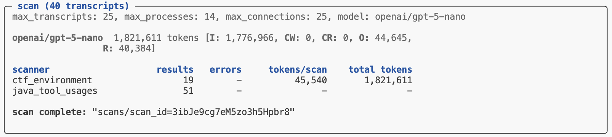

# Results


## Overview

The results of scans are stored in directory on the local filesystem (by
default `./scans`) or in a remote S3 bucket. When a scan job is
completed its directory is printed, and you can also use the
`scan_list()` function or `scout scan list` command to enumerate scan
jobs.

Scan results include the following:

- Scan configuration (e.g. options passed to `scan()` or to
  `scout scan`).

- Transcripts scanned and scanners executed and errors which occurred
  during the last scan.

- A set of [Parquet](https://parquet.apache.org/docs/) files with scan
  results (one for each scanner). There are functions available to
  interface with these files as Pandas data frames or DuckDB databases.

## Workflow

### Scout CLI

The `scout scan` command will print its status at the end of its run. If
all of the scanners completed without errors you’ll see a message
indicating the scan is complete along with a pointer to the scan
directory where results are stored:



You can then pass that directory to the `scan_results()` function to get
access to the underlying data frames for each scanner:

``` python
from inspect_scout import scan_results

results = scan_results("scans/scan_id=3ibJe9cg7eM5zo3h5Hpbr8")
deception_df = results.scanners["deception"]
tool_errors_df = results.scanners["tool_errors"]
```

### Python API

The `scan()` function returns a `Status` object which indicates whether
the scan completed successfully (in which case the scanner results are
available for analysis). You’ll therefore want to check the `.completed`
field before proceeding to read the results. For example:

``` python
from inspect_scout import (
    scan, scan_results, transcripts_from_logs
)

from .scanners import ctf_environment, java_tool_calls

status = scan(
    transcripts=transcripts_from_logs("./logs"),
    scanners=[ctf_environment(), java_tool_calls()]
)

if status.complete:
    results = scan_results(status.location)
    deception_df = results.scanners["deception"]
    tool_errors_df = results.scanners["tool_errors"]
```

### DuckDB

The above examples demonstrated reading scanner output as Pandas data
frames. If you prefer, you can also read scanner data from a DuckDB
database as follows:

``` python
results = scan_results_db("scans/scan_id=3ibJe9cg7eM5zo3h5Hpbr8")
with results:
    # run queries to read data frames
    df = results.conn.execute("SELECT ...").fetch_df()

    # export entire database as file
    results.to_file("results.duckdb")
```

## Results Data

The `Results` object returned from `scan_results()` includes both
metadata about the scan as well as the scanner data frames:

| Field | Type | Description |
|----|----|----|
| `complete` | bool | Is the job complete? (all transcripts scanned) |
| `spec` | ScanSpec | Scan specification (transcripts, scanners, options, etc.) |
| `location` | str | Location of scan directory |
| `summary` | Summary | Summary of scan (results, errors, tokens, etc.) |
| `errors` | list\[Error\] | Errors during last scan attempt. |
| `scanners` | dict\[str, pd.DataFrame\] | Results data for each scanner (see [Data Frames](#scanner-data) for details) |

### Data Frames

<style type="text/css">
#scanner-data td:nth-child(2) {
  font-size: 0.9em;
  line-height: 1.2;
}
#scanner-data small {
  font-size: x-small;
}
</style>

The data frames available for each scanner contain information about the
source evaluation and transcript, the results found for each transcript,
as well as data on token usage, model calls, and errors which may have
occurred during the scan.

The data frame includes the following fields (note that some fields
included embedded JSON data, these are all noted below):

| Field | Type | Description |
|----|----|----|
| `transcript_id` | str | Globally unique identifier for a transcript (maps to `EvalSample.uuid` in the Inspect log or `sample_id` in Inspect analysis data frames). |
| `transcript_source_id` | str | Globally unique identifier for a transcript source (maps to \`eval_id\` in the Inspect log and analysis data frames). |
| `transcript_source_uri` | str | URI for source data (e.g. full path to the Inspect log file). |
| `transcript_metadata` | dict JSON | Eval configuration metadata (e.g. task, model, scores, etc.). |
| `scan_id` | str | Globally unique identifier for scan. |
| `scan_tags` | list\[str\]JSON | Tags associated with the scan. |
| `scan_metadata` | dictJSON | Additional scan metadata. |
| `scanner_key` | str | Unique key for scan within scan job (defaults to `scanner_name`). |
| `scanner_name` | str | Scanner name. |
| `scanner_file` | str | Source file for scanner. |
| `scanner_params` | dictJSON | Params used to create scanner. |
| `input_type` | transcript \| message \| messages \| event \| events | Input type received by scanner. |
| `input_ids` | list\[str\]JSON | Unique ids of scanner input. |
| `input` | ScannerInputJSON | Scanner input value. |
| `value` | JsonValueJSON | Value returned by scanner. |
| `value_type` | string \| boolean \| number \| array \| object \| null | Type of value returned by scanner. |
| `answer` | str | Answer extracted from scanner generation. |
| `explanation` | str | Explanation for scan result. |
| `metadata` | dictJSON | Metadata for scan result. |
| `message_references` | list\[Reference\]JSON | Messages referenced by scanner. |
| `event_references` | list\[Reference\]JSON | Events referenced by scanner. |
| `scan_error` | str | Error which occurred during scan. |
| `scan_error_traceback` | str | Traceback for error (if any) |
| `scan_total_tokens` | number | Total tokens used by scan. |
| `scan_model_usage` | dict \[str, ModelUsage\]JSON | Token usage by model for scan. |
| `scan_events` | list\[Event\]JSON | Scan events (e.g. model event, log event, etc.) |
| `validation_target` | JsonValueJSON | Target value from validation set. |
| `validation_result` | JsonValueJSON | Result returned from comparing `validation_target` to `value`. |

Several of these fields can be used to link back to the source eval log
and sample for the transcript:

- `transcript_id` — This is the same as the `EvalSample.uuid` in the
  Inspect log or the `sample_id` in data frames created by
  [samples_df()](https://inspect.aisi.org.uk/reference/inspect_ai.analysis.html#samples_df).

- `transcript_source_id` — This is the same as the `eval_id` in both the
  Inspect log and Inspect data frames.

- `transcript_source_uri` — This is the full path (filesystem or S3) to
  the actual log file where the transcript was read from.
