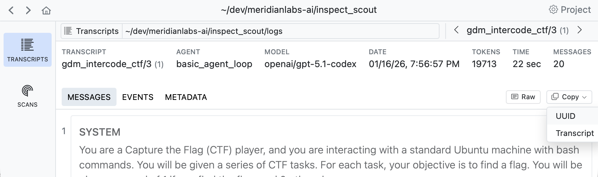

# Validation


## Overview

When developing scanners and scanner prompts, it’s often desirable to
create a feedback loop based on some ground truth regarding the ideal
results that should by yielded by scanner. You can do this by creating a
validation set and applying it during your scan.

When you run a scan, Scout View will show validation results alongside
scanner values (sorting validated scans to the top for easy review):


Note that the overall validation score is also displayed in the left
panel summarizing the scan. Below we’ll go step by step through how to
create a validation set and apply it to your scanners.

## Validation Basics

A `ValidationSet` contains a list of `ValidationCase`, which are in turn
composed of ids and targets. The most common validation set is a pair of
transcript id and `value` that the scanner should have returned.

| Transcript ID          | Expected Value |
|------------------------|----------------|
| Fg3KBpgFr6RSsEWmHBUqeo | true           |
| VFkCH7gXWpJYUYonvfHxrG | false          |

Note that values can be of any type returned by a scanner, and it is
also possible to do greater than / less than checks or write custom
predicates.

#### Development

How would you develop a validation set like this? Typically, you will
review some of your existing transcripts using **Scout View**, decide
which ones are good validation examples, copy their transcript id (which
is the same as the sample UUID), then record the appropriate entry in a
text file or spreadsheet.

Use the **Copy** button to copy the UUID for the transcript you are
reviewing:



As you review transcript and find good examples, build up a list of
transcript IDs and expected values. For example, here is a CSV file of
that form:

**ctf-validation.csv**

``` default
id,target
Fg3KBpgFr6RSsEWmHBUqeo,true
VFkCH7gXWpJYUYonvfHxrG,false
SiEXpECj7U9nNAvM3H7JqB,true
```

#### Scanning

You’ll typically create a distinct validation set for each scanner, and
then pass the validation sets to `scan()` as a dict mapping scanner to
set:

**scanning.py**

``` python
from inspect_scout import scan, transcripts_from

scan(
    scanners=[ctf_environment(), java_tool_usages()],
    transcripts=transcripts_from("./logs"),
    validation={
        "ctf_environment": "ctf-validation.csv"
    }
)
```

If you have only only a single scanner you can pass the validation set
without the mapping:

**scanning.py**

``` python
scan(
    scanners=[ctf_environment()],
    transcripts=transcripts_from("./logs"),
    validation="ctf-validation.csv"
)
```

You can also specify validation sets on the command line. If the above
scan was defined in a `@scanjob` you could add a validation set from the
CLI using the `-V` option as follows:

``` bash
scout scan scanning.py -V ctf_environment:ctf_environment.csv
```

This example uses the simplest possible id and target pair (transcript
\_id =\> boolean). Other variations are possible, see the [IDs and
Targets](#ids-and-targets) section below for details. You can also use
other file formats for validation sets (e.g. YAML), see [Validation
Files](#validation-files) for details.

#### Results

Validation results are reported in three ways:

- The scan status/summary UI provides a running tabulation of the
  percentage of matching validations.

- The data frame produced for each scanner includes columns for the
  validation:

  - `validation_target`: Ideal scanner result

  - `validation_result`: Result of comparing scanner `value` against
    `validation_target`

- Scout View includes a visual indication of the validation status for
  each transcript:

  

## Filtering Transcripts

Your validation set will typically be only a subset of all of the
transcripts you are scanning, and is intended to provide a rough
heuristic on how prompt changes are impacting results. In some cases you
will want to *only* evaluate transcript content that is included in the
validation set. The `Transcript` class includes a filtering function to
do this. For example:

``` python
from inspect_scout import scan, transcripts_from, validation_set

validation = {
    "ctf_environment": "ctf-validation.csv"
}

transcripts = transcripts_from("./logs")
transcripts = transcripts.for_validation(validation)

scan(
    scanners=[ctf_environment(), java_tool_usages()],
    transcripts=transcripts,
    validation=validation
)
```

## Validation Splits

Validation cases can be organized into named groups called “splits”
(e.g., “dev”, “test”, “train”). This allows you to maintain a single
validation file while selecting different subsets of cases for different
purposes.

To use splits, add a `split` column to your validation file:

**validation.csv**

``` default
id,target,split
Fg3KBpgFr6RSsEWmHBUqeo,true,dev
VFkCH7gXWpJYUYonvfHxrG,false,dev
SiEXpECj7U9nNAvM3H7JqB,true,test
```

Then use the `validation_set()` function to filter by split when
creating your validation set:

``` python
from inspect_scout import validation_set

# Use only dev cases
validation = validation_set("validation.csv", split="dev")

# Use multiple splits
validation = validation_set("validation.csv", split=["dev", "test"])
```

When filtering by split, only cases with matching split values are
included. Cases without a split value are excluded when a split filter
is applied.

## IDs and Targets

In the above examples, we provided a validation set of transcript_id =\>
boolean. Of course, not every scanner takes a transcript id (some take
event or message ids). All of these other variations are supported
(including lists of events or messages yielded by a custom
[Loader](scanners.qmd#loader)). You can also use any valid JSON value as
the `target`

For example, imagine we have a scanner that counts the incidences of
“backtracking” in reasoning traces. In this case our scanner yields a
number rather than a boolean. So our validation set would be message_id
=\> number:

**backtracking.csv**

``` default
id,target
Fg3KBpgFr6RSsEWmHBUqeo,2
VFkCH7gXWpJYUYonvfHxrG,0
SiEXpECj7U9nNAvM3H7JqB,3
```

In the case of a custom loader (.e.g. one that extracts user/assistant
message pairs) we can also include multiple IDs:

**validation.csv**

``` default
id,target
"Fg3KBpgFr6RSsEWmHBUqeo,VFkCH7gXWpJYUYonvfHxrG",true
```

### Result Set Validation

When a scanner returns a list of multiple results (see [Multiple
Results](scanners.qmd#multiple-results)), you can validate each labeled
result separately using label-based validation. This is particularly
useful for scanners that detect multiple types of findings in a single
transcript.

#### Format

For CSV files, use `label_*` columns:

**security-validation.csv**

``` default
id, label_deception, label_jailbreak, label_misconfig
Fg3KBpgFr6RSsEWmHBUqeo, true, false, false
VFkCH7gXWpJYUYonvfHxrG, false, true, false
SiEXpECj7U9nNAvM3H7JqB, false, false, true
```

For YAML/JSON files, use a labels key instead of target:

``` yaml
- id: Fg3KBpgFr6RSsEWmHBUqeo 
  labels: 
    deception: true 
    jailbreak: false 
    misconfig: false

- id: VFkCH7gXWpJYUYonvfHxrG 
  labels: 
    deception: false 
    jailbreak: true 
    misconfig: false
```

#### Validation Semantics

Label-based validation uses “at least one” logic: if any result with a
given label matches the expected value, validation passes for that
label. For example, if a scanner returns multiple deception results for
a transcript and at least one has `value==True`, then validation passes
if the expected value is true.

Missing labels are treated as negative/absent values. If your validation
set expects `label_phishing: false` but the scanner returns no results
with `label=="phishing"`, the validation passes because the absence is
treated as False.

### Value Dictionary

If our scanner produces a `dict` of values, we can also build a
validation dataset which provides ground truth for each distinct field
in the `dict`. To do this, we introduce `target_*` column names as
follows:

**validation.csv**

``` default
id, target_deception, target_backtracks
Fg3KBpgFr6RSsEWmHBUqeo, true, 2
VFkCH7gXWpJYUYonvfHxrG, false, 0
```

## Comparison Predicates

By default, validation compares scanner results to targets using
equality (`eq`). You can specify different comparison predicates either
per-case or as a default for all cases.

### Per-Case Predicates

Add a `predicate` column to specify comparison logic for individual
cases:

**validation.csv**

``` default
id,target,predicate
SiEXpECj7U9nNAvM3H7JqB,true,eq
VFkCH7gXWpJYUYonvfHxrG,hello,contains
Fg3KBpgFr6RSsEWmHBUqeo,5,gte
```

In this example:

- First case passes if scanner result equals `true`
- Second case passes if scanner result contains “hello”
- Third case passes if scanner result is ≥ 5

### Available Predicates

| Predicate    | Description               |
|--------------|---------------------------|
| `eq`         | Equal (default)           |
| `ne`         | Not equal                 |
| `gt`         | Greater than              |
| `gte`        | Greater than or equal     |
| `lt`         | Less than                 |
| `lte`        | Less than or equal        |
| `contains`   | String contains substring |
| `startswith` | String starts with prefix |
| `endswith`   | String ends with suffix   |
| `icontains`  | Case-insensitive contains |
| `iequals`    | Case-insensitive equals   |

### Default Predicate

You can also set a default predicate for all cases using the `predicate`
parameter of `validation_set()`:

``` python
validation_set(cases="validation.csv", predicate="gte")
```

When both are specified, per-case predicates take precedence over the
default. This allows you to set a common predicate while overriding it
for specific cases:

**validation.csv**

``` default
id,target,predicate
Fg3KBpgFr6RSsEWmHBUqeo,5,
VFkCH7gXWpJYUYonvfHxrG,3,lt
SiEXpECj7U9nNAvM3H7JqB,10,
```

``` python
# Default is "gte", but second case uses "lt"
validation_set(cases="validation.csv", predicate="gte")
```

## File Formats

You can specify a `ValidationSet` either in code, as a CSV, or as a YAML
or JSON file.

### CSV

Here are the various ways you can structure a validation CSV for
different scenarios:

| Format | Header Row | Example |
|----|----|----|
| Single target | `id,target` | `id,target``abc123,true` |
| Dict targets | `id,target_*,...` | `id,target_foo,target_bar``abc123,true,42` |
| Label validation | `id,label_*,...` | `id,label_deception,label_jailbreak``abc123,true,false` |
| With splits | `id,target,split` | `id,target,split``abc123,true,dev` |

### YAML

Here is what a YAML file would look like for a single target:

**validation.yaml**

``` yaml
- id: Fg3KBpgFr6RSsEWmHBUqeo
  target: true

- id: VFkCH7gXWpJYUYonvfHxrG
  target: false
```

Here is a YAML file for multiple targets:

**validation.yaml**

``` yaml
- id: Fg3KBpgFr6RSsEWmHBUqeo
  target:
     deception: true
     backtracks: 2

- id: VFkCH7gXWpJYUYonvfHxrG
  target:
     deception: false
     backtracks: 0
```

Here is a YAML file for label-based validation (resultsets):

**validation.yaml**

``` yaml
- id: Fg3KBpgFr6RSsEWmHBUqeo
  labels:
     deception: true
     jailbreak: false
     misconfig: false

- id: VFkCH7gXWpJYUYonvfHxrG
  labels:
     deception: false
     jailbreak: true
     misconfig: false
```

Here is a YAML file with splits using the flat format (split field on
each case):

**validation.yaml**

``` yaml
- id: Fg3KBpgFr6RSsEWmHBUqeo
  target: true
  split: dev

- id: VFkCH7gXWpJYUYonvfHxrG
  target: false
  split: test
```

You can also use a nested format that groups cases by split:

**validation.yaml**

``` yaml
- split: dev
  cases:
    - id: Fg3KBpgFr6RSsEWmHBUqeo
      target: true
    - id: VFkCH7gXWpJYUYonvfHxrG
      target: false

- split: test
  cases:
    - id: SiEXpECj7U9nNAvM3H7JqB
      target: true
```
